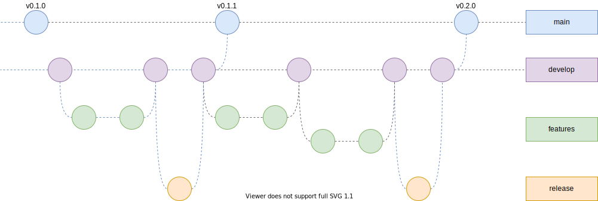

# release-test

## 要件

- Semantic Versioning によるリリースバージョンの管理
- changelog の自動化
	- Github のリリースページ
	- CHANGELOG.md
- Github flow ぐらいシンプルな方向で

## ブランチ戦略

### main

- リリース時に更新される
- develop -> main へのマージコミット
	- develop で検証済みなので可能であれば PR は省略したい
- develop と同じものになる
- マージコミットが作られると同時にそこにタグが打たれ、リリース処理が実行される
	- リリース処理は手動で再実行できるようにする
- ここからブランチを切ることはない

## develop

- 開発ブランチ
- 機能ブランチはここから作る
- 常に実行可能であること

## features

- 機能開発ブランチ
- hotfix も含まれる(Github flow の main と feature の関係)
- conventional commit に従っており、綺麗なコミットであること(基本1つで良い)

## release

- リリース作業用のブランチ
- 手動で作ることはない
- ツールにより以下の作業をする
	- develop の head から ブランチを切る
	- バージョンを更新する
	- CHANGELOG を作る
	- develop への PR を作成する
- 問題なければ自動でマージし、 develop -> main への マージへ移行する
- 問題ある場合は手動で内容を修正しpush する
	- CHANGELOG 生成に失敗しているなど